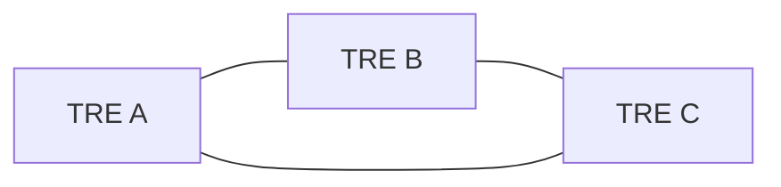
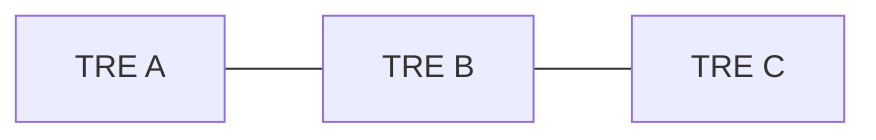
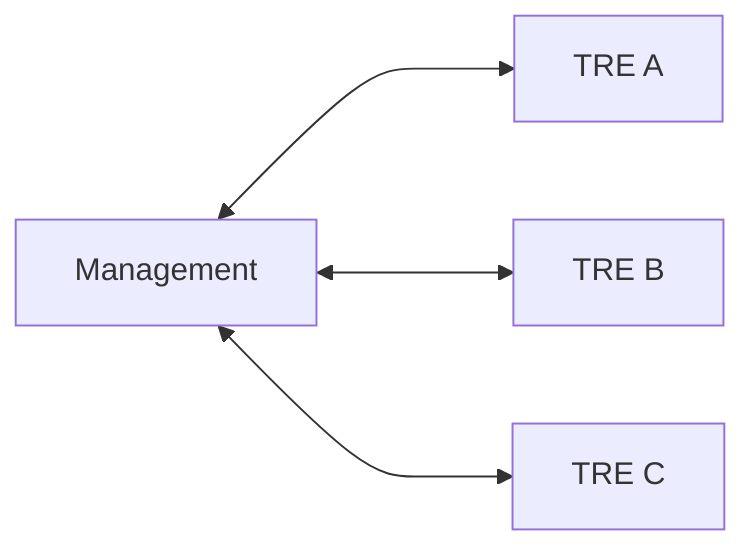
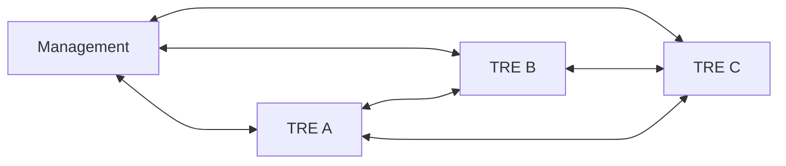
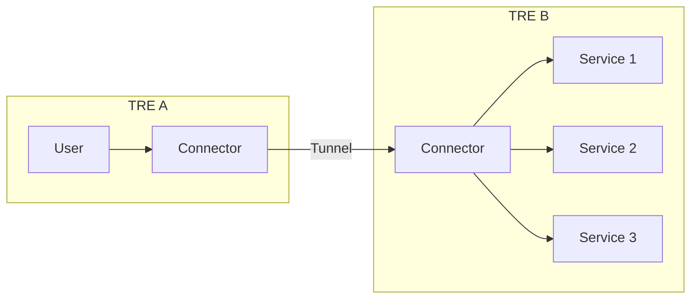
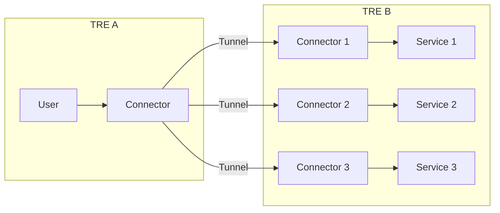

# What is a connector?

## Status

Proposed

We have two options for defining what a _Connector_ is, but we are not yet in a position to decide whether one is better than the other.

## Context

In a TRE federation a user or service in one TRE must be able to connect to a service running in another TRE.
For example

- a user in a TRE makes an API request to a service running in another TRE
- two services in different TREs may communicate with each other

The _Connector_ is the networking component that enables this to happen.

This document contains the abstract definition of a _Connector_.
The following are out of scope, and will be covered in other documents:

- Implementation options

In this document _TRE_ is used as shorthand for a data zone, query managmeent zone, or any other similar zone running inside a secure tenancy.
(Yes I know I've opened a whole can or worms here about terminology and glossaries)

## Decision

A _connector_ is a networking component that logically sits at at the boundary of a TRE and an external network.
Each TRE or TRE service may have it's own _connector_, depending on implementation and segregation/filtering choices.

### Network management

Connectors in multiple TREs will need to connect to each other.
There must be a central managment service that controls logical routing between pairs of connectors depending on what the federation has agreed.
The central managment service may be standalone, or co-located with a TRE.

#### Logical routing

For example, in a federation of three TREs, the federation may decide to allow connections between all pairs of TREs

Or only between two pairs

#### Physical routing

The physical network topology is independent of the logical routing.
For example, a TRE federation may support a hub and spoke model with all traffic routed through the managment node, which has ther advantage of minimising the number of network connections that need to be setup and secured:

Or it may support a full peer-to-peer mesh network which means data can be transmitted more efficiently:

### Local control

Connectors must be deployed by individual TREs.
TREs must have the option to disable the connector, thus disconnecting themselves from the federation.

### How many connectors per TRE

There are two (or three?) deployment patterns that we are considering

#### One connector per TRE

A TRE deploys a single Connector.
The connector can make connections to multiple services running inside the TRE, subject to what the TRE admin has allowed the connector to connect to.
The connector is responsible for routing incoming requests to the correct service, which means the TRE admin has full control over what an incoming request can reach.

#### One connector per service

A TRE deploys one connector for each service that may be accessed over the federation.
Access control to the service is therefore delegated to the central management node since this is purely dependent on what logical routes are allowed.

#### Combined option

There is another option that combines the two, in which a TRE deploys a single connector, but all internal routing to services is voluntarily delegated to the central management node.

## Consequences

TODO

## References

- [Kickoff 17/11/2025 #12](https://github.com/DAREUK/tetres/issues/12)
- [Connector: what is it? #20](https://github.com/DAREUK/tetres/issues/20)
- [Document mesh networking options #23](https://github.com/DAREUK/tetres/issues/23)
- [Document pros/cons of the two main Netbird client deployment methods #36](https://github.com/DAREUK/tetres/issues/36)
